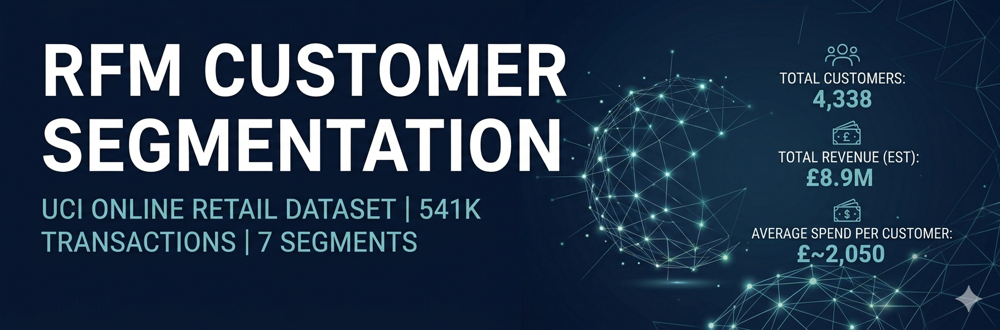
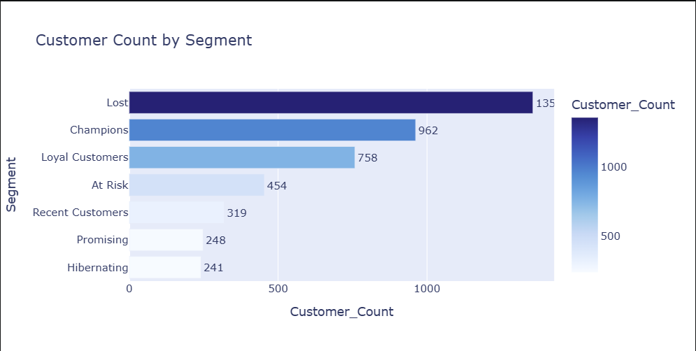
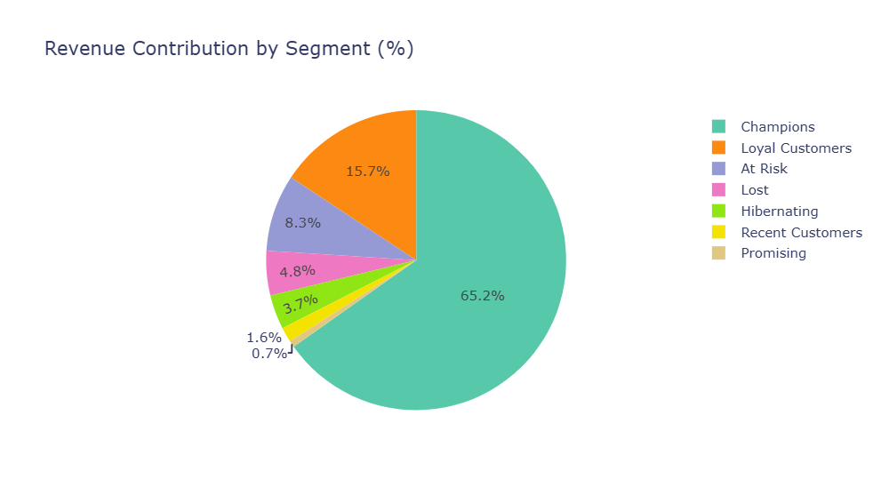
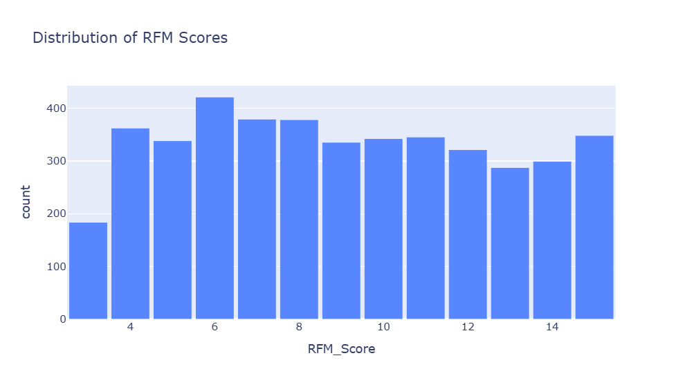

# RFM Customer Segmentation — UCI Online Retail Dataset



Recreated RFM (Recency, Frequency, Monetary) segmentation methodology on the UCI Online Retail Dataset — 541K transactions across 38 countries, segmented into 7 behavioral customer groups with actionable retention strategies.

---

## Problem Statement

E-commerce businesses treat all customers the same — same emails, same discounts, same campaigns. This project identifies which customers are worth retaining, which are slipping away, and which are already lost — so marketing budget goes where it actually creates value.

---

## Dataset

- **Source:** UCI Machine Learning Repository — Online Retail Dataset
- **Size:** 541,909 transactions | Dec 2010 – Dec 2011
- **Scope:** UK-based online retailer selling gift/homeware products
- **Customers:** 4,338 (after cleaning guest checkouts and cancellations)

---

## Methodology

### Data Cleaning
- Removed 135,080 rows with missing CustomerID (guest checkouts)
- Removed 8,905 cancellation invoices (InvoiceNo starting with 'C')
- Removed 40 rows with negative/zero Quantity or UnitPrice
- Created `TotalPrice = Quantity × UnitPrice`

### RFM Scoring

Each customer scored 1–5 on three dimensions using quintile-based scoring:

| Dimension | Definition | Scoring Logic |
|-----------|------------|---------------|
| Recency | Days since last purchase | Lower = better (score 5) |
| Frequency | Number of unique orders | Higher = better (score 5) |
| Monetary | Total spend (£) | Higher = better (score 5) |

### Segmentation Rules

Customers assigned to 7 segments based on R, F, M score combinations.

---

## Results


| Segment | Customers | Revenue | Avg Spend | Avg Recency |
|---------|-----------|---------|-----------|-------------|
| Champions | 962 | 65.2% | £6,038 | 13 days |
| Loyal Customers | 758 | 15.7% | £1,842 | 36 days |
| At Risk | 454 | 8.3% | £1,634 | 142 days |
| Lost | 1,356 | 4.8% | £313 | 173 days |
| Hibernating | 241 | 3.7% | £1,367 | 182 days |
| Recent Customers | 319 | 1.6% | £458 | 19 days |
| Promising | 248 | 0.7% | £252 | 53 days |

**Key Insight:** Top 39.7% of customers (Champions + Loyal) drive 80.9% of revenue — more extreme than the classic Pareto 80/20 rule.

---

## Visualizations

### Customer Count by Segment



### Revenue Contribution by Segment



### Recency vs Monetary Value



---

## Business Recommendations

- **Champions (65.2% revenue):** Launch VIP loyalty program. Losing 10% of Champions = ~£580K annual revenue loss.
- **Loyal Customers:** Target with bundle and upsell campaigns. Converting 20% to Champion tier = ~£800K revenue uplift.
- **At Risk (141 days inactive):** Deploy win-back email with 10–15% discount. 30% reactivation = £222K recovered.
- **Hibernating (181 days inactive):** 'We miss you' campaign — high historical spend makes reactivation worth attempting before writing off.
- **Lost:** Single exit survey only. Redirect saved marketing budget to Champions retention and At Risk win-back.
- **Recent Customers:** Trigger onboarding email sequence within 7 days of first purchase. Goal: second purchase within 60 days.
- **Promising:** First-repeat-purchase incentive (free shipping or small discount) to activate the future Champion pipeline.

---

## Tech Stack

- **Python:** Pandas, NumPy, Matplotlib, Plotly
- **Environment:** Jupyter Notebook
- **Data Source:** UCI ML Repository

---

## Project Structure

```
rfm-segmentation/
├── images/
│   ├── rfm_banner.png
│   ├── bar_chart.png
│   ├── pie_chart.png
│   ├── rfm_table.png
│   └── scatter.png
├── data/
│   ├── rfm_scored.csv
│   └── segment_summary.csv
└── notebook/
    └── rfm_analysis.ipynb
```

---

## Key Learnings

- RFM is a simple but powerful framework — three numbers tell you almost everything about a customer's behavioral pattern
- Revenue concentration is more extreme than expected: top 22% of customers drive 65% of revenue
- Segment-specific actions outperform generic campaigns — the At Risk segment alone represents £742K in recoverable revenue
- Guest checkouts (24.9% of raw data) are a significant data quality issue in e-commerce analytics — always validate CustomerID completeness before any cohort analysis
